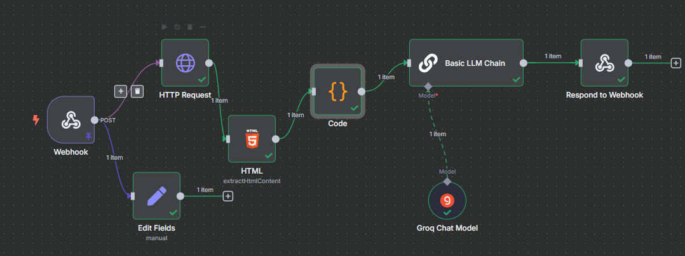

<p align="left">
  
</p> # Blog Summarizer App

This project is a **Next.js** web application that allows users to input a blog URL and receive a smart summary in both **English** and **Urdu**. It uses **n8n** for automation, AI-powered summarization (via LLM), and dynamic content extraction from the target blog.

---

## ✨ Features

- 🔗 Input any public blog/article URL
- 📑 Get a Gen Z-style summary in English
- 🌐 Urdu translation of the same summary
- 🧠 LLM-based summarization and translation powered by n8n
- 🎨 **Modern, premium UI/UX**: glassmorphism, animated gradients, blurred backgrounds, and advanced cards
- 🌗 **Theme toggle**: Light/Dark mode with animated backgrounds and dynamic color schemes
- 🟠 Responsive design for all devices
- 🧩 Reusable components (Input, Button, Card, Tabs, Textarea)
- 🗄️ Summarization results are stored in Supabase for future use/history
- 🏆 Features grid, hero section, and modern footer with social icons
- 🔧 Easily extendable for more languages, formats, or channels (e.g., email)

---

## 🖌️ Modern UI & Theme System

- **Glassmorphism**: Frosted glass cards and forms for a premium look
- **Animated Backgrounds**: Blurred video and animated blobs for depth and motion
- **Theme Toggle**: Switch between light (orange/yellow/white) and dark (indigo/purple/black) modes
- **Persistent Preference**: Theme is saved in localStorage and respects system preference
- **Dynamic Visuals**: Backgrounds and blobs update instantly with theme changes
- **Footer Glow & Section Dividers**: Subtle effects for visual separation

---

## 🛠 How It Works

1. User enters a blog URL and clicks **Summarise**
2. The frontend sends this URL to an **n8n Webhook**
3. n8n:
   - Fetches the HTML content via **HTTP Request**
   - Extracts readable text via **HTML Extract** node
   - Joins and formats the text using a **Code node**
   - Sends a **prompt to an LLM** (e.g., OpenAI) to summarize & translate
   - Returns the final combined response (English + Urdu)
4. The frontend **splits the English and Urdu parts** and displays them in tabs

---

## 🖼️ n8n Workflow Diagram



_Visual overview of the n8n workflow used for blog summarization and translation._

---

## 🚀 Getting Started

### 1. Install Frontend Dependencies

```bash
npm install
```

### 2. Run the Frontend Dev Server

```bash
npm run dev
```

Open [http://localhost:3000](http://localhost:3000) in your browser.

### 3. Set Up n8n Workflow

**n8n Workflow Nodes:**

- **Webhook** (POST, path: `summarise`)
- **HTTP Request** (GET content from `{{ $json["body"]["BlogUrl"] }}`)
- **HTML Extract** (CSS selector: `p`, Return Value: Text, Return Array: ON, Key: `text`)
- **Code** (joins paragraphs, builds LLM prompt, outputs `chatInput`)
- **LLM** (uses `chatInput`, returns Gen Z summary + Urdu translation as one string in `text`)
- **Respond to Webhook** (returns `{ text: "...combined response..." }`)

### 4. Configure Frontend Webhook URL

Inside `src/components/BlogForm.tsx`, set your webhook URL:

```js
const N8N_WEBHOOK_URL = "http://localhost:5678/webhook/summarise";
```

### 5. Frontend Response Handling

The returned `text` field contains both English and Urdu sections. The app splits them like this:

```js
const [englishPart, urduPart] = (data.text || "").split(
  /And here'?s the translation in Urdu:/i
);

setSummary({
  en: englishPart?.trim() || "",
  ur: urduPart?.trim() || "",
});
```

---

## 🧪 Example

- **Input URL:** https://cupofjo.com/
- **Output:**
  - English summary in bullet points
  - Urdu translation of those points in tabs

---

## 🚀 Deployment Notes

- Deploy frontend to Vercel or your server
- Run n8n locally (`n8n start`) or host it via n8n Cloud
- Secure your webhook and LLM keys before public deployment

---

## 🧰 Tech Stack

- **Frontend:** React (Next.js + TypeScript)
- **UI:** Tailwind CSS, shadcn/ui, Lucide icons
- **Backend Automation:** n8n.io
- **AI Integration:** LLM (OpenAI or others)
- **Database:** Supabase (stores summarization results)
- **Data Extraction:** HTML parsing with CSS selectors

---

## 📝 License

MIT
